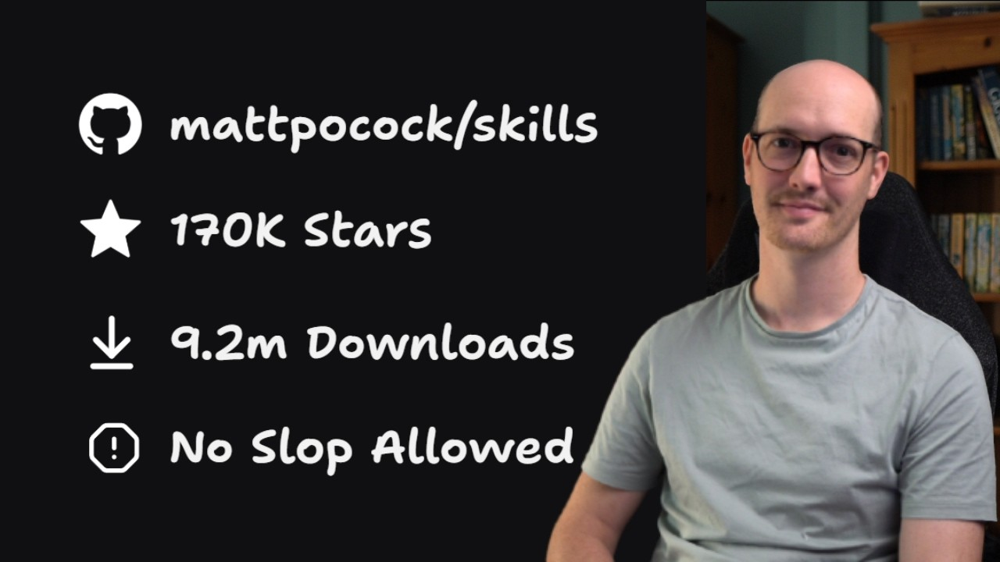

<!-- _class: lead -->

# A plugin for improved development workflows

## Summary and practical example from Matt Pocock's recent YouTube video

<br>

<span class="note">Five skills you invoke by name, plus the session discipline that makes them work.
Installable as a Claude Code plugin, or copied into your repo for any other agent.</span>

<!--
Stand-alone deck — assumes nothing from any other talk. Open by saying what this
is: one practitioner's end-to-end system for agentic coding, not a framework and
not an autonomous agent. Everything here comes from one video and the public
repository behind it.
-->

---

## The source

<p class="lede">One video, and the public repository of skills it walks through.</p>

<div class="srcs one">
<div class="src">



</div>
<div class="src">

<div class="t">mattpocock/skills: A complete AI Coding workflow, end-to-end</div>
<div class="m">youtube.com/watch?v=M6mYodf0dJM<br>17 min 17 s · @mattpocockuk</div>
<div class="d">published 2026-07-16 — 7 weeks old</div>

</div>
</div>

<span class="note">Everything on the following slides comes from that video and from the repository it
describes.</span>

<!--
Say the date out loud. The point is that the audience can judge for themselves
how stale any of this might be by the time they try it.
-->

---

<!-- _class: tight -->

## What the plugin actually adds

<p class="lede">Out of the box, an agent starts editing on your first sentence. This is what belongs before it.</p>

Ask a generic coding agent for a feature and it begins at once, filling every
ambiguity with a plausible assumption and telling you about none of them. You find
out which ones by reading the diff, and you pay for the wrong ones twice.

So the plugin installs **named commands for the phases you were doing in your
head** — none of them on by default in Claude Code, Codex or Cursor:

<div class="cols3">
<div class="card">

#### 1 — Understand
`/grill-with-docs` interviews you until you and it describe the same thing.

</div>
<div class="card">

#### 2 — Write it down
`CONTEXT.md`, ADRs, a spec on the tracker — it outlives the session.

</div>
<div class="card">

#### 3 — Cut to size
`/to-tickets` slices the work so each piece fits one fresh window.

</div>
</div>

> **Why that should cost less:** structure removes the two dearest things an agent
> does — work you throw away, and context you re-establish.

<span class="note">His number underneath it all: a session gets <em>"significantly dumber"</em> past <strong>140 000 tokens</strong> — below that is the <strong>smart zone</strong>.</span>

---

<!-- _class: diagram -->

## The main flow

<p class="lede">Five user-invoked skills. Everything else in the repo is a variation on this spine.</p>

```
   a vague idea
        │
        ▼
   /grill-with-docs ── it interviews you until you have a shared understanding
        │              writes CONTEXT.md + docs/adr/*.md while it goes
        │
        ├─────────────────────────────▶  /implement    ← fits in one session: go
        │
        ▼
   /to-spec         ── the DESTINATION. published to your issue tracker
        │
        ▼
   /to-tickets      ── the ROUTE. one ticket ≈ one context window
        │
        ▼
   /implement       ── one ticket per session; /clear in between
        │              drives /tdd, then calls…
        ▼
   /code-review     ── two parallel sub-agents: Standards axis, Spec axis
```

---

## Setup — getting the skills

<p class="lede">Two installation routes, two different philosophies. Pick one: installing both gives you every skill twice.</p>

```bash
# Claude Code: managed, read-only bundle, updates when he ships
claude plugins install mattpocock-skills          # or /plugin install … in-session

# Codex, Cursor, anything else — and for tinkerers on Claude Code too:
# copies editable skill files into your repo, which you then own
npx skills@latest add mattpocock/skills           # needs Node.js; installer is skills.sh, by Vercel
npx skills update                                 # pull his later changes when *you* want them
```

The `npx` installer asks which skills to take and which agents to install them
for. **Make sure `setup-matt-pocock-skills` is one of them** — the rest of the
engineering skills refuse to run without the config it writes.

<span class="note">Context cost is deliberately small: in the video, with every official skill installed,
<code>/context</code> reported the whole set at <strong>660 tokens</strong>. The skills are
user-invoked with short descriptions, so they do not leak into every request.</span>

---

## Setup — `/setup-matt-pocock-skills`

<p class="lede">Run once per repo, before anything else. It asks three questions and then writes files.</p>

<div class="cols wide-left">
<div>

**1 — Issue tracker.** GitHub (`gh`), GitLab (`glab`), local markdown under `.scratch/<feature>/`, or *"other"* — describe Jira/Linear/Beads in a paragraph and it records that prose as the workflow.

**2 — Triage labels.** Defaults are the five canonical roles: `needs-triage`, `needs-info`, `ready-for-agent`, `ready-for-human`, `wontfix`. Accept them unless your tracker already uses other names.

**3 — Domain doc layout.** Single-context (one `CONTEXT.md` + `docs/adr/` at the root) is right for almost every repo. Multi-context is offered only if it detects real monorepo signals.

</div>
<div>

```
CLAUDE.md          ← adds an
                     "## Agent skills"
                     block: pointers only
docs/agents/
  issue-tracker.md
  triage-labels.md
  domain.md
CONTEXT.md         ← the glossary
docs/adr/          ← decision records
.scratch/<feature>/
                   ← if you chose the
                     local tracker
```

<span class="note">It edits <code>CLAUDE.md</code> if present, else <code>AGENTS.md</code>; it never creates the second one.</span>

</div>
</div>

---

<!-- _class: tight -->

## Step 1 — `/grill-with-docs`

<p class="lede">The agent interviews you. You do not write a plan; you answer questions until you and it agree.</p>

It is `/grill-me` — a relentless interview that walks each branch of the design
tree — **plus domain modelling**. Before it asks anything it reads `CONTEXT.md`,
so the questions come back in the vocabulary your repo already uses; where your
answer collides with that glossary, it says so, and you settle the wording there
and then.

<div class="cols">
<div>

### Not "write me a plan"
Ambiguity becomes a **question put to you**, not a quiet assumption buried in a
document you then have to proof-read.

</div>
<div>

### It writes while it talks
`CONTEXT.md` and `docs/adr/*.md` are updated **during** the conversation — the
next slide is why those two files earn their keep.

</div>
</div>

<span class="note">You stop when you both agree the design tree has been walked. The demo settled in
six questions; expect more on anything real.</span>

---

<!-- _class: tight -->

## Why the language questions come first

<p class="lede">Not bikeshedding. The glossary becomes the identifiers in the generated code.</p>

<div class="cols">
<div>

### `CONTEXT.md`
The **ubiquitous language** of domain-driven design (Evans): one vocabulary shared by the domain expert, the developer and the code.

Same repo, same sentence:

*BEFORE* — "there's a problem when a lesson inside a section of a course is made 'real', i.e. given a spot in the file system"

*AFTER* — "there's a problem with the **materialization cascade**"

</div>
<div>

### `docs/adr/`
For what a glossary cannot hold. Write an ADR only when **all three** hold:

- the decision is **hard to reverse**
- it would be **surprising without context**
- it was a **real trade-off**, with consequences downstream

<span class="note">"We picked library A over B, and they're interchangeable" fails all three. Don't write it down.</span>

</div>
</div>

<span class="note">Claimed payoff: shorter replies, fewer thinking tokens, greppable names. <span class="tag">HIS OBSERVATION, NOT MEASURED</span></span>

---

## Steps 2 and 3 — `/to-spec`, then `/to-tickets`

<p class="lede">The fork in the road, taken at the end of the grilling session — in the same context window, no clear.</p>

If the work fits one session, skip both and type `/implement this`. If it does
not, you need a **destination** and a **route**:

<div class="cols">
<div class="card">

#### `/to-spec` — the destination
No interview: it synthesises what you just discussed into problem statement, solution, user stories, implementation decisions, testing decisions — then publishes it to the tracker with the `ready-for-agent` label.

</div>
<div class="card">

#### `/to-tickets` — the route
Tracer-bullet vertical slices, each declaring which tickets **block** it, each sized to one context window. Tickets stay short: the acceptance criteria already live in the spec.

</div>
</div>

**A real shape**, from the demo: one spec issue with **11 sub-issues** — eleven
sessions. And you argue with it: when it proposed three slices for a small job,
he replied *"do it in one slice instead"*, and it re-planned.

---

## Steps 4 and 5 — `/implement` and `/code-review`

<p class="lede">The only part that touches code. It ends by reviewing itself — in someone else's context window.</p>

`/implement` builds one ticket: drives `/tdd` at the seams agreed in the spec,
type-checks and runs single test files as it goes, runs the full suite once at
the end, then calls `/code-review`, then commits to the current branch.

`/code-review` diffs `git diff <fixed-point>...HEAD` — three dots, so against the
merge base — and runs **two sub-agents in parallel**:

<div class="cols">
<div class="card">

#### Standards axis
Against your repo's documented coding standards. If you have none, it falls back to a Martin Fowler code-smell baseline.

</div>
<div class="card">

#### Spec axis
Cross-checks every acceptance criterion in the originating spec against what was actually built.

</div>
</div>

> Sub-agents are not a detail. An agent that just wrote the code is bad at
> criticising it — *"they wrote it, so they think that's fine."* A clean context
> window reviews better, and the two axes do not pollute each other.

---

<!-- _class: tight -->

## Session hygiene — the actual discipline

<p class="lede">The skills are the easy part. This is the habit that makes them work.</p>

- **Plan in one unbroken context window.** `/grill-with-docs` → `/to-spec` →
  `/to-tickets` all happen in the same session; the spec is a compression of that
  conversation, so you must not clear before writing it.
- **`/clear` between every implementation ticket.** Then `/implement` and point
  at the ticket. Squeeze a second ticket into the same window only if you are
  well inside the smart zone.
- **Watch the token counter, not the wall clock.** In the demo he called out
  46.1k after grilling and 42.7k for the implementation, against his ~140k budget.
- **He was in Claude Code's auto mode, not plan mode** — the grilling skill *is*
  the planning step.
- **The spec is disposable.** When the work lands he closes the spec issue and
  deletes it: *"once the spec is present in the code, you can just delete the
  spec."* That is the explicit break with spec-driven development, where the spec
  is kept and edited forever.

---

## Which one, when

<p class="lede">The whole decision, on one slide. Reach for the smallest thing that fits.</p>

<div class="rows">
<div class="row"><div class="k">No codebase at all — a decision, an outline, a document</div><div class="v"><strong>/grill-me</strong></div></div>
<div class="row"><div class="k">Codebase, and the work fits one session</div><div class="v"><strong>/grill-with-docs</strong> → /implement</div></div>
<div class="row"><div class="k">Codebase, several sessions</div><div class="v"><strong>/grill-with-docs</strong> → /to-spec → /to-tickets → /implement ×N → /code-review</div></div>
</div>

> The rule underneath all three: **if you can plan it in a single session, plan it
> in a single session.** Ceremony you do not need costs a context window you could
> have spent on the work itself.

<span class="note">`/grill-me` is on the list because it is not code-specific: it is an interview
skill, and it works on anything you have to think through and write down.</span>

---

<!-- _class: lead -->

# What to take from this

<br>

- The **context window is the unit of work.** Size tickets to it, clear between
  them, and stop trusting a session before it fills
- **Write the glossary down.** `CONTEXT.md` is cheap, and it renames your
  variables for you
- **Separate destination from route** — a spec is where you are going, tickets
  are how you get there, and the spec is disposable once the code exists
- **Review in a fresh context.** The agent that wrote it is the worst reviewer of it

<br>

<span class="note">Caveats worth stating to colleagues: this is one practitioner's opinionated system,
and the numbers in it are habits from daily use rather than benchmarks. If you
standardise on it, pin a version — the skills change under you otherwise.</span>
